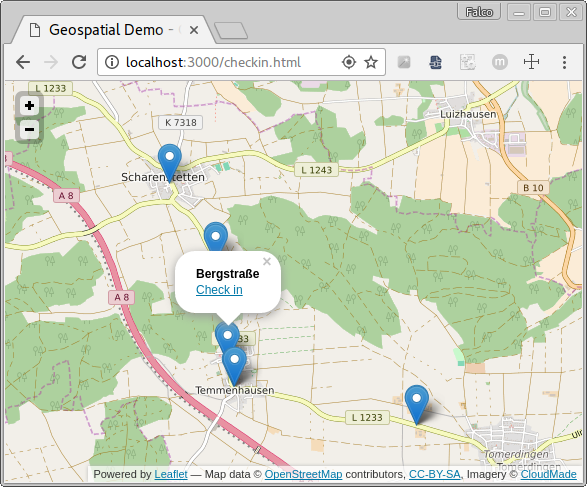

# Geospatial Demo App

An example implementation of a location-based service to demonstrate the power of MongoDB, node.js and Websockets.

It provides three basic services/pages: 
* Check-in from the user's actual position (determined via the HTML5 Geolocation API)
* Show the current checkin-ins live
* Check-in to a location nearby the user's position

As example locations the user can check-in, this demo application uses the bus stops of the city of Ulm, provided by [UlmApi](http://ulmapi.de) under [CC BY-SA 3.0](http://creativecommons.org/licenses/by-sa/3.0/). The first two services can be used without these data, but make sure to zoom to your current location in the map, as Ulm, Germany will be preselected.
You might check-in to Ulm's locations from anywhere else - MongoDB's geospatial index will find the nearest bus stop at Ulm even if it's miles away.

## Technologies

* [node.js](http://nodejs.org): General Platform
* [MongoDB](http://mongodb.com): NoSQL database
* [Express](http://expressjs.com): Middleware Framework
* [Socket.io](http://socket.io): Messaging library
* [Leaflet](http://leafletjs.com): JavaScript mapping library
* [HTML5 Geolocation API](http://www.w3schools.com/html/html5_geolocation.asp): Locate user's position

## Installation

You will need [node.js](http://nodejs.org) and MongoDB to run the demo server. Make sure to have at least version 2.0 of MongoDB as the UlmApi bus stop example data will contain [multi-location documents](http://docs.mongodb.org/manual/core/geospatial-indexes/#multi-location-documents).
You can install the demo server via:

	npm install

This will import the [UlmApi](http://ulmapi.de) example data into a fresh MongoDB collection called `haltestellen` (german for bus stops) inside the `geospatial-demo` database. A geospatial index for the `geometry.features.geometry.coordinates` field is automatically created.

Simply start the server via:

	npm start

## Pages

* `/checkin-simple.html` - Check-in at user's position
* `/checkin.html` - Check-in at a bus stop in the city of Ulm, Germany
* `/show.html` - Show check-ins live